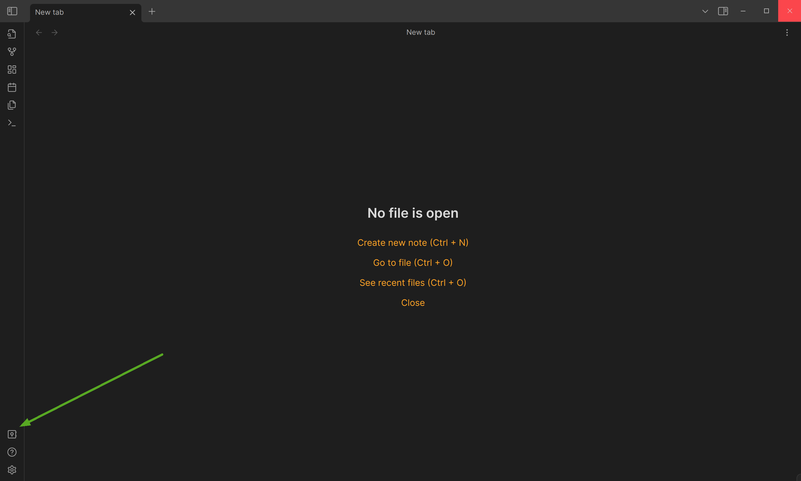
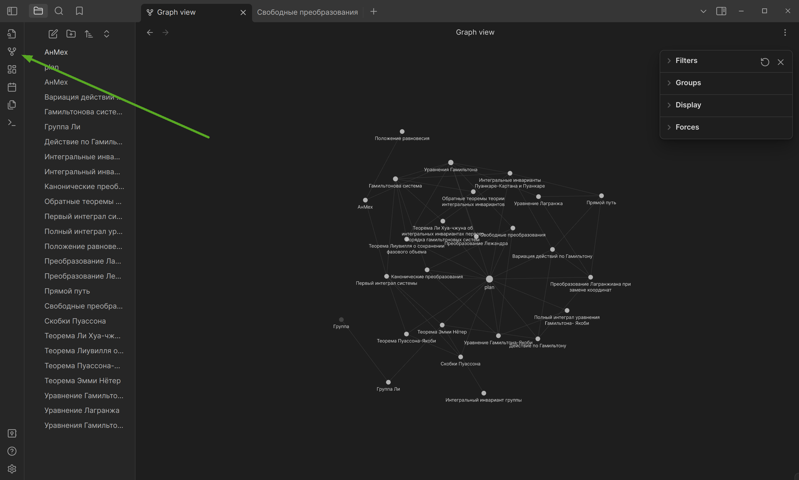

## Содержание
1) [Курс лекций Климанова](https://github.com/YasnoDelo/Obsidian/tree/main/Telecom)
2) [Подготовка к КР Климанова(Сделано так, чтобы всё читалось прямо с репозитория без запуска Obsidian)](https://github.com/YasnoDelo/Obsidian/tree/main/network_assessment)
3) [Инфа по конфигам в GNS3(Для Packet Tracer тоже сгодится)](https://github.com/YasnoDelo/Obsidian/tree/main/GNS3)
4) [Теорвер Горяйного](https://github.com/YasnoDelo/Obsidian/tree/main/Teorver)
5) [2 семестр анмеха](https://github.com/YasnoDelo/Obsidian/tree/main/%D0%90%D0%BD%D0%9C%D0%B5%D1%85)
6) [Гармонический анализ Знаменской](https://github.com/YasnoDelo/Obsidian/tree/main/%D0%9C%D0%B0%D1%82%D0%90%D0%BD)
7) [Оптика, общая физика](https://github.com/YasnoDelo/Obsidian/tree/main/%D0%A4%D0%B8%D0%B7%D0%9E%D1%81)
8) Немного мелочи по Git и Unix
## Как запустить чтобы всё работало

1. Скачайте Obsidian: https://obsidian.md/download. Появится приложение вида: $Obsidian-1.5.12.AppImage$, где $1.5.12$ - это версия приложения.
2. Затем разрешите выполнять этот файл как программу. Запустите.
3. Выберите папку, в которой будете хранить базу данных. 
4. Откройте терминал, перейдите в эту папку.
5. Наберите: 
```shell
git init
```
```shell
git clone https://github.com/YasnoDelo/Obsidian
```
6. Готово, можно выбирать нужную папку в Obsidian и открыть её с помощью уже работающего приложения:

7. Клацните на эту кнопку, чтобы открыть записи в виде общего графа:


