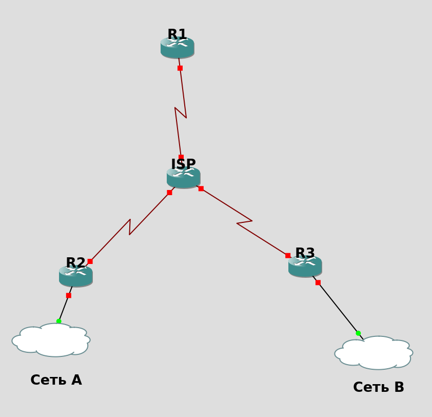
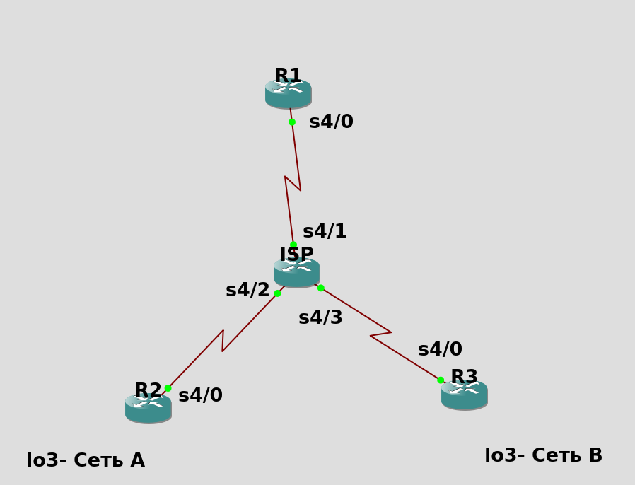

Формулировка:
Все роутеры соединены по Frame Relay. Нужно добиться того, чтобы в нормальном состоянии весь траффик от Сети A (в дальнейшем `loopbak3`) до Сети B (в дальнейшем `loopbak3`) шёл через R1, а при его отключении - только через ISP

Решение - сделать туннели между R2-R1 и R3-R1 (чтобы их поднять, нужно прописать статику до нужного интерфейса) и запустить по туннелям OSPF, а также статику с метрикой 200 (или любое другое число больше 110 {метрика OSPF}) до Сети X, которая будет работать при выключении R1

Допвопрос - настроить не через статику на Сеть X, а через OSPF

Решение - прокинуть туннель между R2 и R3 (через статику до нужного IP) и на нём тоже запустить тот же процесс OSPF, что и выше, но настроить на интерфейсах туннеля cost 200, а на всех остальных туннелях сделать cost 1. При выключении R1 сработает запись через новый туннель. Новый туннель **менее** приоритетный в случае работающего R1.



### Сначала настроим FR:

R1
```
conf t

int se4/0
no sh
ip add 10.10.10.1 255.255.255.0
enc frame-rel
frame-rel intf dte
frame-relay interface-dlci 101
frame-relay map ip 10.10.10.10 101
```

R2
```
conf t

int se4/0
no sh
ip add 20.20.20.2 255.255.255.0
enc frame-rel
frame-rel intf dte
frame-relay interface-dlci 102
frame-relay map ip 20.20.20.10 102
```

R3
```
conf t

int se4/0
no sh
ip add 30.30.30.3 255.255.255.0
enc frame-rel
frame-rel intf dte
frame-relay interface-dlci 103
frame-relay map ip 30.30.30.10 103
```

ISP (далее у него будет адрес x.x.x.10)
```
conf t

int se4/1
no sh
ip add 10.10.10.10 255.255.255.0
enc frame-rel
frame-rel intf dce
frame-rel interface-dlci 101
frame-relay map ip 10.10.10.1 101

int se4/2
no sh
ip add 20.20.20.10 255.255.255.0
enc frame-rel
frame-rel intf dce
frame-relay interface-dlci 102
frame-relay map ip 20.20.20.2 102


int se4/3
no sh
ip add 30.30.30.10 255.255.255.0
enc frame-rel
frame-rel intf dce
frame-relay interface-dlci 103
frame-relay map ip 30.30.30.3 103

```

### Теперь пингуются соседи. ПодниМЕМ туннели R1-R2 и R1-R3 

R1
```
ip route 20.20.20.0 255.255.255.0 10.10.10.10
ip route 30.30.30.0 255.255.255.0 10.10.10.10

int tun0
ip add 12.12.12.1 255.255.255.0 
tunnel mode gre ip
tunnel source se4/0
tunnel destination 20.20.20.2
keepalive

int tun1
ip add 13.13.13.1 255.255.255.0 
tunnel mode gre ip
tunnel source se4/0
tunnel destination 30.30.30.3
keepalive
```

R2
```
ip route 10.10.10.0 255.255.255.0 20.20.20.10

int tun0
ip add 12.12.12.2 255.255.255.0 
tunnel mode gre ip
tunnel source se4/0
tunnel destination 10.10.10.1
keepalive
```

R3
```
ip route 10.10.10.0 255.255.255.0 30.30.30.10

int tun1
ip add 13.13.13.3 255.255.255.0 
tunnel mode gre ip
tunnel source se4/0
tunnel destination 10.10.10.1
keepalive
```

### Теперь, когда работают туннели, можно запустить на них OSPF (на интерфейсах-Сетях тоже запускаем, чтобы о них узнала другая сеть):

R1
```
router ospf 1
net 12.12.12.0 0.0.0.255 a 0
net 13.13.13.0 0.0.0.255 a 0
```

R2
```
// loo3 - это Сеть A
int loo3 
ip add 2.2.2.2 255.255.255.0

router ospf 1
net 12.12.12.0 0.0.0.255 a 0
net 2.2.2.0 0.0.0.255 a 0
```

R3
```
// loo3 - это Сеть B
int loo3
ip add 3.3.3.3 255.255.255.0

router ospf 1
net 13.13.13.0 0.0.0.255 a 0
net 3.3.3.0 0.0.0.255 a 0
```

### Теперь Сети пингуюся! Что характерно - через R1:
```
R3(config-if)#do trace 2.2.2.2 source 3.3.3.3
Type escape sequence to abort.
Tracing the route to 2.2.2.2
VRF info: (vrf in name/id, vrf out name/id)
  1 13.13.13.1 16 msec 56 msec 32 msec
  2 12.12.12.2 60 msec 56 msec 56 msec
```

### Добавим "чтобы работало" static:

R2
```
ip route 3.3.3.0 255.255.255.0 20.20.20.10 200
```

R3
```
ip route 2.2.2.0 255.255.255.0 30.30.30.10 200
```

ISP:
```
ip route 3.3.3.0 255.255.255.0 30.30.30.3
ip route 2.2.2.0 255.255.255.0 20.20.20.2
```

При выключении R1:
```
R3(config-if)#do trace 2.2.2.2 source 3.3.3.3
Type escape sequence to abort.
Tracing the route to 2.2.2.2
VRF info: (vrf in name/id, vrf out name/id)
  1 30.30.30.10 8 msec 24 msec 8 msec
  2 20.20.20.2 12 msec 16 msec 16 msec
```

`source 3.3.3.3` указываем, чтобы приходил ответ

# Но это решение на уд(4)!!! Так что вдарим динамики в этой дыре!

R2
```
no ip route 3.3.3.0 255.255.255.0 20.20.20.10 200
```

R3
```
no ip route 2.2.2.0 255.255.255.0 30.30.30.10 200
```

ISP:
```
no ip route 3.3.3.0 255.255.255.0 30.30.30.3
no ip route 2.2.2.0 255.255.255.0 20.20.20.2
```

R2
```
ip route 30.30.30.0 255.255.255.0 20.20.20.10

int tun2
ip add 23.23.23.2 255.255.255.0 
ip ospf cost 200
tunnel mode gre ip
tunnel source se4/0
tunnel destination 30.30.30.3
keepalive

int tun0
ip ospf cost 1

router ospf 1
net 23.23.23.0 0.0.0.255 a 0
```

R3
```
ip route 20.20.20.0 255.255.255.0 30.30.30.10

int tun2
ip add 23.23.23.3 255.255.255.0 
ip ospf cost 200
tunnel mode gre ip
tunnel source se4/0
tunnel destination 20.20.20.2
keepalive

int tun1
ip ospf cost 1

router ospf 1
net 23.23.23.0 0.0.0.255 a 0
```

R1
```
int tun1
ip ospf cost 1

int tun0
ip ospf cost 1
```
### Теперь при выключенном R1:
```
R3(config-router)#do trace 2.2.2.2 source 3.3.3.3
Type escape sequence to abort.
Tracing the route to 2.2.2.2
VRF info: (vrf in name/id, vrf out name/id)
  1 23.23.23.2 12 msec 24 msec 24 msec
```

```
R3(config-router)#do sh ip rou 2.2.2.2           
Routing entry for 2.2.2.2/32
  Known via "ospf 1", distance 110, metric 201, type intra area
  Last update from 23.23.23.2 on Tunnel2, 00:02:48 ago
  Routing Descriptor Blocks:
  * 23.23.23.2, from 20.20.20.2, 00:02:48 ago, via Tunnel2
      Route metric is 201, traffic share count is 1
                       ^
                       |  (!!!)
```
### При включённом R1:
```
R3(config-if)#do trace 2.2.2.2 source 3.3.3.3
Type escape sequence to abort.
Tracing the route to 2.2.2.2
VRF info: (vrf in name/id, vrf out name/id)
  1 13.13.13.1 16 msec 28 msec 20 msec
  2 12.12.12.2 52 msec 40 msec 40 msec
```

```
R3(config-if)#do sh ip rou 2.2.2.2           
Routing entry for 2.2.2.2/32
  Known via "ospf 1", distance 110, metric 3, type intra area
  Last update from 13.13.13.1 on Tunnel1, 00:02:29 ago
  Routing Descriptor Blocks:
  * 13.13.13.1, from 20.20.20.2, 00:02:29 ago, via Tunnel1
      Route metric is 3, traffic share count is 1
                      ^
                      |  (!!!)
```

В итоге хор(5) за то, что забыл, что cost выставляется на интерфейсе и вообще медленно натсраивал (сдавал Никите)