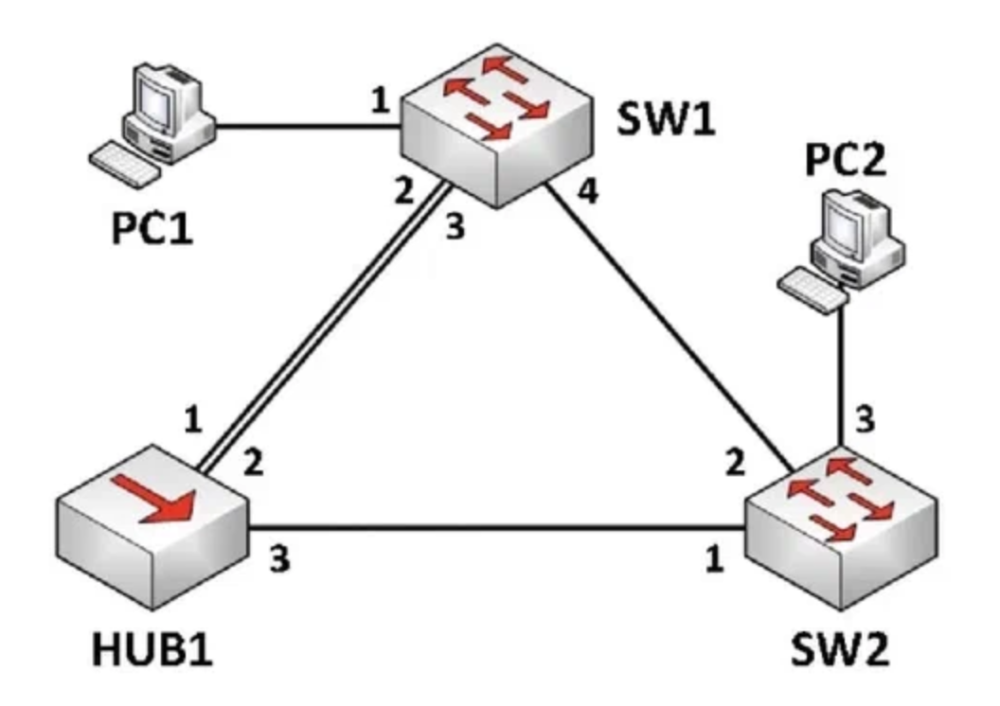
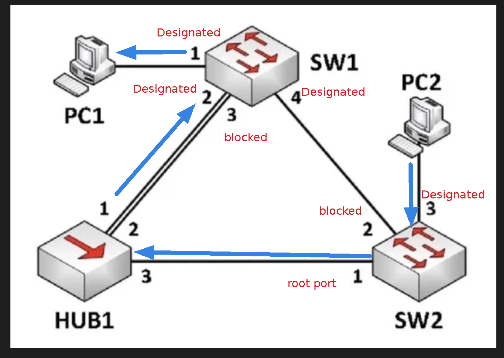
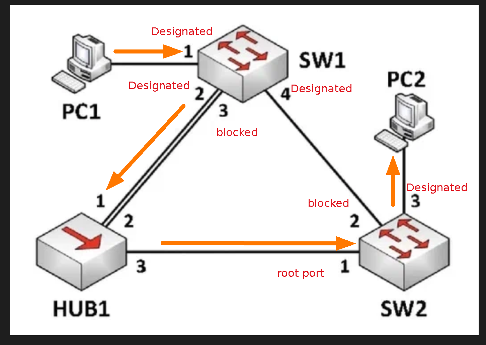
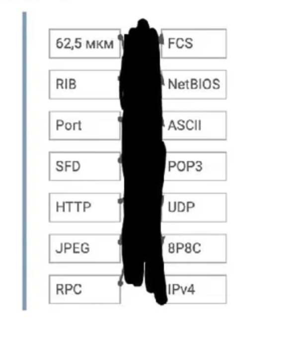
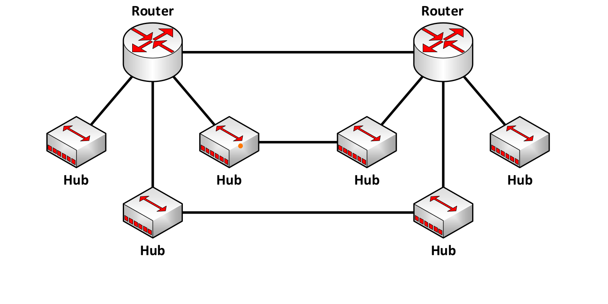
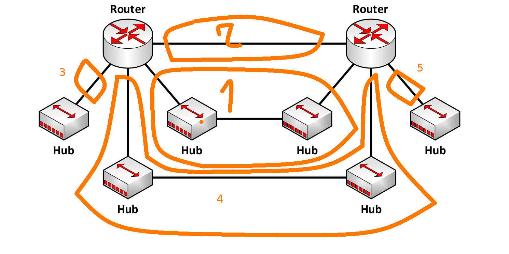
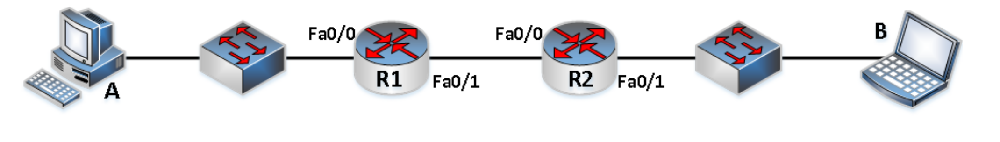
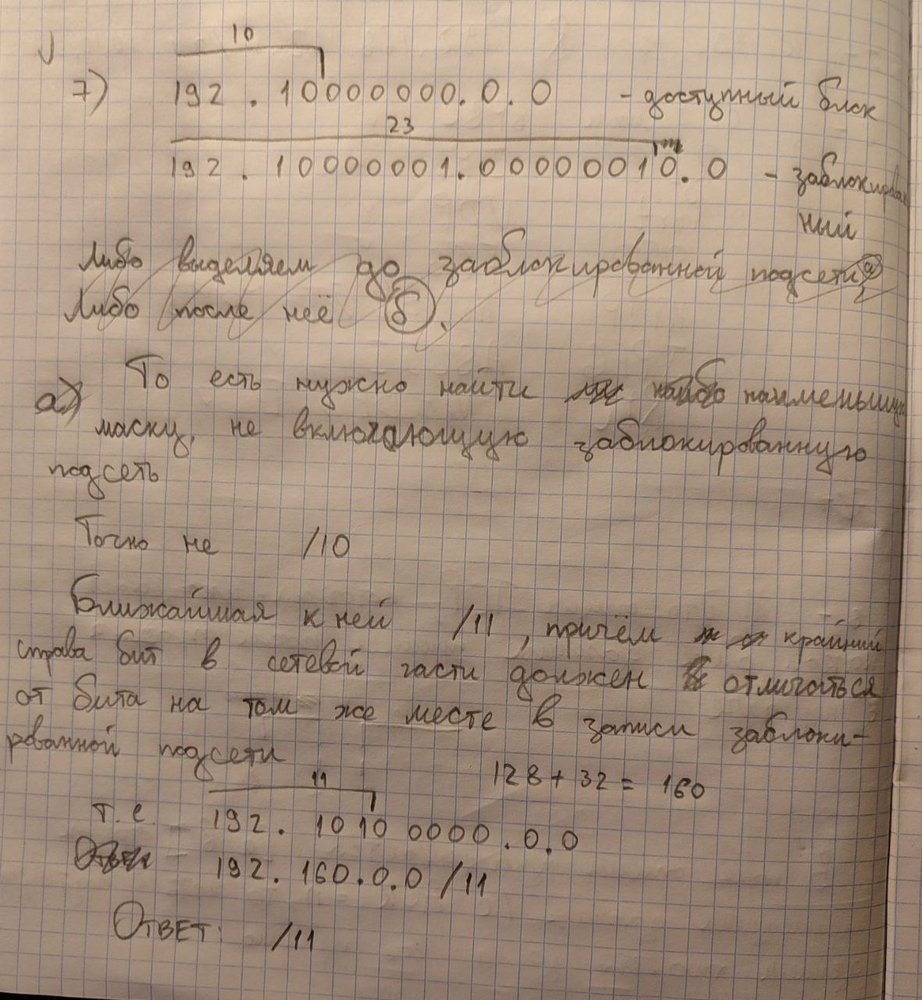
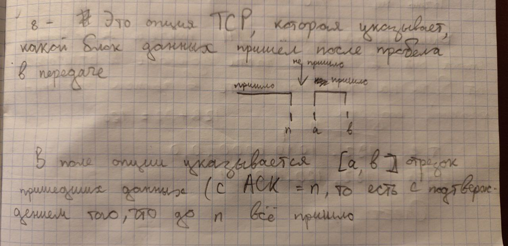

Вовсе не слив:
1) Точно нужно повторить способы избежания зацикливаний в RIP
2) Повторить задачки на количество подсетей в подсети
3) Повторить задачи на подсчёт broadcast/collision domain
4) Повторить классовую адресацию и перевод из неё в CIDR
5) Повторить зарезервированные под особые нужды (или просто серые) IP адреса
6) Повторить опции TCP 
 
### 1) В вашем распоряжении находятся три последовательных подсети класса В. Имеющееся адресное пространство разделите на четыре подсети так, чтобы не оставалось нераспределённых адресов. Приведите пример такого деления.

Решение:

класс В: 128.0.0.0-191.255.255.255
последовательные = выделяются друг за другом. То есть без "дырок" между ними

пусть есть 3 подсети 128.0.0.0, 129.0.0.0, 130.0.0.0 (все /16)

10000000.0.0.0, 10000001.0.0.0, 10000010.0.0.0

для выполнения условия (в котором ничего не сказано про то, что сети должны быть одного размера)
можно разделить одну из сетей напополам, а остальные оставить как есть

то есть в итоге подсети разделятся на 

a) 128.0.0.0      - 128.127.255.255
b) 128.128.0.0  - 128.255.255.255
c) 129.0.0.0      - 129.255.255.255
d) 130.0.0.0      - 130.255.255.255

### 2) Что такое микросегментация (выберите всё, что подходит)?

| вопрос                                                                                                                                                                                                   | ответ                                                                                  |
| -------------------------------------------------------------------------------------------------------------------------------------------------------------------------------------------------------- | -------------------------------------------------------------------------------------- |
| Деление протоколом ТСР сообщений от вышележащих протоколов так, чтобы получаемые в результате последовательной инкапсуляции (ТСР->IР-› ->Eth) Ethernet кадры были меньше минимального размера.        | нет: меньше минимального - очень странно                                               |
| Деление промежуточным маршрутизатором проходящего IP-пакета (DF=0) на две части так, что размер одной из них равен MTU следующего перехода, а второй - минимальной оставшейся части исходного пакета. | нет: это просто сегментация                                                            |
| Деление локальной сети на минимальное количество коллизионных доменов так, чтобы оно удовлетворяло правилу 5-4-3.                                                                                        | нет, микросегментация - это деление на максимальное количество колизионных доменов     |
| Деление адресного пространства на подсети так, чтобы количество подсетей было минимальным.                                                                                                               | нет: микросегментация это как раз наоборот деление на максимальное количество подсетей |
| Всё вышеперечисленное.                                                                                                                                                                                   | нет                                                                                    |
| Нет правильного ответа                                                                                                                                                                                   | да                                                                                     |
Циатата из методички Климанова:
*Микросегметация – разбиение коммутатором одного домена коллизий на меньшие коллизионные домены. В итоге в одном сегменте сети оставалось только два устройства, одно из которых – порт коммутатора.*
### 3) Коммутатор работает в режиме fragment free. Опишите ситуацию, при которой такой коммутатор выполнит коммутацию в режиме store&forward.

Пояснение:
fragment free - читаем только первые 64 байта и сразу отправляем
store&forward - читаем всё, проверяем хеш сумму и только после этого форвардим

- **Высокая вероятность ошибок**: если в сети наблюдается большое количество ошибок или повреждений, коммутатор может переключиться на _store-and-forward_, чтобы проверять весь пакет на ошибки перед передачей. Это помогает предотвратить распространение поврежденных данных.
    
- **QoS или политики безопасности**: если включены функции, требующие анализа всего пакета, такие как качество обслуживания (QoS) или расширенные политики безопасности (например, проверка содержимого пакета), коммутатор должен буферизовать весь пакет для корректной обработки.
    
- **Разница скоростей портов**: если пакет поступает на один порт с высокой скоростью и должен быть передан на порт с более низкой скоростью, полная буферизация (как в _store-and-forward_) может использоваться для регулирования потока и предотвращения потерь данных.
### 4) Компьютер подключён к глобальной сети и имеет IP-адрес 1.2.243.0/n. Укажите маску максимальной длины, которую может иметь данный узел.

1.2.243.0 = 0000==0001==.0000==0010==.1111==0011==.0000==0000== (подсветка для удобства)

маска не может быть равна 24(==00000001.00000010.11110011==.00000000), так как в таком случае адрес компьютера был бы равен адресу подсети, что недопустимо

то есть максимальная длина маски **n = 23**

### 5) Локальная сеть одной из комнат студенческого общежития представлена ниже. Укажите на схеме, как будут передаваться данные между РС1 и РС2, если МАС-адрес SW1 равен 0001.2233.4455, а МАС-адрес SW2 равен 0002.2233.4455. Все настройки оборудования оставлены по умолчанию. Все линки - Fast Ethernet. При необходимости свой ответ поясните. 

==!!!!!!!!!1Пусть все провода ful-duplex!!!!!!!==

Сначала настраивается STP:

Root Bridge в нашем случае это свитч с мЕньшим MAC-адрессом. То есть SW1

В данном случае все порты в SW1 назначенные и порт 3 на SW2 тоже назначенный

Порт 1 на SW2 это Root Port, так как на него приходят BPDU с мЕньшими Port ID
Порт 2 на SW2 заблокируется

Получается, что порты распределены так:

Тогда пакеты пойдут соотвесвенно:

### 6) Назовите и опишите процедуру корректировки максимального размера PDU для ТСР-сессий в момент установления соединения, в которой не применяется протокол ICMP.
1) Инициирование соединения:
	Клиент отправляет пакет SYN на сервер для инициирования соединения TCP. 
2) Включить опцию MSS: 
	Клиент включает опцию TCP MSS в пакет SYN, указывая максимальный размер сегмента, который он готов принять. 
3) Вмешательство Router: 
	Маршрутизатор по пути может просмотреть параметры TCP и заменить значение в поле MSS на то, которое он поддерживает Если маршрутизатор этого не сделает, сервер сделает сам

### 7) Перед вами пример таблицы маршрутизации. Укажите запись, которая будет использована для перенаправления IP-пакета с адресом получателя равным 192.168.117.148 (в дальнейшем DST).
- 0 192.168.117.0/32 10.10.10.3 
- R 192.168.112.0/21 10.10.10.4 
- S 0.0.0.0/0 10.10.10.5 C 
- O 192.186.117.128/25 10.10.10.6 
- С 192.168.117.0/25 10.10.10.7 
- Нет правильного ответа.

Решение: 
 1) Не первый ответ, так как DST не входит в подсеть 192.168.117.0/32
 2) Подходит!
 3) Не третий, так как есть ответ с бОльшей маской
 4) Не подходит, так как там 186, а не 168 в записи
 5) Не подходит, так как DST не входит в подсеть
 6) Правильный ответ 4

### 8) Соедините друг с другом термины, аббревиатуры, технологии, протоколы и характерные величины из левого и правого столбцов, относящиеся к одному уровню модели OSI. 

 
| 1        | 2       | Объяснение                                                          |
| -------- | ------- | ------------------------------------------------------------------- |
| 62,5 мкм | 8P8C    | Физический уровень                                                  |
| RIB      | IPv4    | RIB = Router Information Base - очев                                |
| Port     | UDP     | UDP используется в купе с портом, по которому он робит              |
| SFD      | FCS     | Части Ethernet-фрейма                                               |
| HTTP     | POP3    | Оба сервиса работают на уровне приложения                           |
| JPEG     | ASCII   | Уровень представления данных                                        |
| RPC      | NetBIOS | ХЗ, по остаточному принципу. Вроде оба работают на сеансовом уровне |
### 9) Что из перечисленного ниже подходит к механизму Fast Retransmission. Выберите всё, что подходит.

а) При повторном открытии ТСР-соединения между теми же самыми узлами, «тройное рукопожатие» не требуется, можно сразу снова передавать данные. 
**---- Вообще мимо**
b) Получатель данных с помощью ТСР-механизмов SACK и NACK обеспечивает частичное подтверждение получения, заставляя отправителя быстрее начинать повторную отправку данных. 
**---- SACK И NACK в Fast Retransmition никак не участвуют**
с) Отправитель данных с помощью ТСР-механизмов SACK и NACK уведомляет получателя о том, какие данные уже были отправлены, чтобы получатель мог быстрее запросить переотправку данных. 
**---- SACK И NACK в Fast Retransmition никак не участвуют**
d) Механизм оптимизации RIPv2, позволяющий вновь подключившемуся маршрутизатору запросить повторную отправку RIP Updates без ожидания окончания hello interval. 
**-- Нетъ**
е) Оптимизация протокола UDP, позволяющая добавить в него механизмы гарантированной доставки. 
**---- Вообще мимо**
f) Ничего из вышеперечисленного.

Ответ: f)

Пояснение:
**Эта оптимизация TCP не использует TCP-опции, а использует механизмы классического TCP.**
==Fast Retransmission== – быстрая повторная отправка. Применяется, когда на стороне получателя что-то не пришло (кусочек), а дальше он опять продолжает получать дан-
ные. По правилам отправитель должен повторно отправить всё заново. Но у получателя есть возможность «намекнуть» отправителю, что потерялось что-то конкретное. Когда получатель понимает, что в какой-то момент данные потерялись, он отправляет сразу три подтверждения о получении данных до этого самого места. То есть три раза подряд, очень быстро отправляет пустые (= без пользовательских
данных) TCP-сегменты с выставленным флагом ACK.

### 10) Опишите работу технологии Route Poisoning, используя приведённую ниже схему.

Пояснение: 
**Route poisoning** – в рамках этой оптимизации, когда мы понимаем, что какая-то сеть недостижима, то не просто исключаем этот префикс из обновлений, а начинаем отправлять обновления об этом префиксе с метрикой 16 (недостижимый маршрут)

На примере: если R1 узнает, что PC1 отключился, то он сразу (не дожидаясь истечения таймера обновления) отправит на R2 сообщение о том, что метрика достижения подсети 192.168.0.0/24 равна 16 (эта подсеть недоступна)

### 11) Посчитайте количество широковещательных и коллизионных доменов для схемы ниже. Все линки Fast  Ethernet и работают в полудуплексном режиме

Границы broadcast доменов - это устройства L3 (L3 коммутаторы или роутеры) и очевидно физические границы самой сети
Границы collision доменов - это устройства L2 и L3 (любые коммутаторы, мосты, роутеры) и очевидно физические границы самой сети
Устройства L1 (Хабы, повторители) не влияют на границы обоих доменов

 В данном случае нет устройств L2 уровня. Поэтому broadcast и collision доменов одинаковое количество - 5

### 12) Что из перечисленного ниже относится к физическому уровню модели OSI. Выберите всё, что подходит.
a) 8P8C
b) Скользящее окно
c) Category 3
d) Store&forward
e) 24 AWG
f) 26 AWG
g) Всё перечисленное выше
h) Ничего из вышеперечисленного

Ответ: 24 AWG, 26 AWG (это стандарты кабелей, отличающиеся по толщине), Category 3 (Это тоже стандарт UTP-кабеля), 8P8C (стандарт коннектора)

### 13) В сети на рисунке ниже везде настроена статическая маршрутизация. Узел A успешно обменивается данными с узлом B. На всех интерфейсах обоих маршрутизаторов включена поддержка Proxy ARP. Укажите, как будет выглядеть ARP-таблица на всех устройствах, где она существует, если используются следующие IP-адреса: A – 192.168.0.2/16; R1 Fa0/0 – 192.168.0.1/24; R1 Fa0/1 –192.168.1.1/24; R2 Fa0/0 – 192.168.1.2/24; R2 Fa0/1 – 192.168.3.1/24; B – 192.168.3.2/24. Выделите те записи, которые появились благодаря работе Proxy ARP (либо явно укажите, что их нет).

$MAC_i$ - MAC адресс устройства i

ARP-таблица PC A:

| MAC                    | IP          | Объяснение                                                         |
| ---------------------- | ----------- | ------------------------------------------------------------------ |
| $MAC_{PC A}$           | 192.168.0.2 | Запись о самом устройстве                                          |
| $MAC_{R1}^{int Fa0/0}$ | 192.168.3.2 | Запись, появившаяся благодаря proxy ARP (так как у PC A маска /16) |

ARP-таблица R1:
==!!!!MAC адреса разных интерфейсов разные!!!!!==

| MAC                    | IP          | Объяснение                                      |
| ---------------------- | ----------- | ----------------------------------------------- |
| $MAC_{PC A}$           | 192.168.0.2 | Запись о PC A                                   |
| $MAC_{R1}^{int Fa0/0}$ | 192.168.0.1 | Запись о самом устройстве (с учётом интерфейса) |
| $MAC_{R1}^{int Fa0/1}$ | 192.168.1.1 | Запись о самом устройстве (с учётом интерфейса) |
| $MAC_{R2}^{int Fa0/0}$ | 192.168.1.2 | Запись об интерфейсе соседа R2                  |

ARP-таблица R2:

| MAC                    | IP          | Объяснение                                      |
| ---------------------- | ----------- | ----------------------------------------------- |
| $MAC_{R1}^{int Fa0/1}$ | 192.168.1.1 | Запись об интерфейсе соседа R1                  |
| $MAC_{R2}^{int Fa0/0}$ | 192.168.1.2 | Запись о самом устройстве (с учётом интерфейса) |
| $MAC_{R2}^{int Fa0/1}$ | 192.168.3.1 | Запись о самом устройстве (с учётом интерфейса) |
| $MAC_{PC B}$           | 192.168.1.2 | Запись о PC B                                   |

ARP-таблица PC B:

| MAC                     | IP          | Объяснение                |
| ----------------------- | ----------- | ------------------------- |
| $MAC_{PC B}$            | 192.168.3.2 | Запись о самом устройстве |
| $MAC_{R2}^{int Fa 0/1}$ | 192.168.3.1 | Запись о соседнем R2      |
### 14) Одна крупная компания решила построить новый дата-центр для размещения майнинговых ферм. Каждая ферма включает в себя 100 узлов и должна размещаться в одной отдельной подсети. Какой минимальный непрерывный блок IPv4 адресов (в формате /n) компании необходимо выделить для того, чтобы адресовать 50 ферм. Свой ответ поясните

100 узлов в одной подсети => на каждую ферму необходима подсеть размером 127, то есть $/32 - 7$

Всего 50 ферм, то есть нужна подсеть размером 63, то есть всего вся подсеть должна быть $/32 - 7 - 6 = /19$

Ответ: $/19$

### 15) У одного очень крупного оператора связи оставался нераспределённым блок адресов 192.128.0.0/10, из которого он выделил одному своему клиенту префикс 192.129.2.0/23. Затем к нему обратился очень крупный клиент с просьбой выделить максимально большой блок адресов из только что «открытого» диапазона 192.128.0.0/10. Блок какого размера (укажите в виде /n) смог бы выделить оператор. Свой ответ поясните.

### 16) Опишите принцип действия механизма SACK (как работает, для чего используется)

